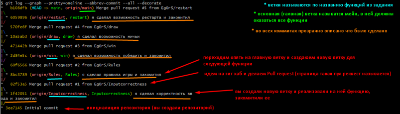
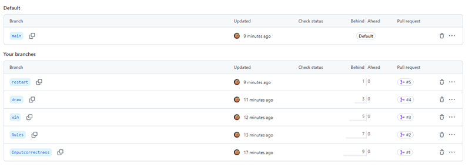

# tic-tac-toe

## Первый этап

**Задание:**
Разработать игру “Крестики нолики”
**Функциональность игры**

- **Корректность ввода:** игра должна принимать корректный ввод от игроков, проверять, чтобы игроки не могли поставить крестик или нолик в уже занятое поле.
- **Правила игры:** игра должна следовать стандартным правилам:
  a. Игроки ходят поочередно.
  b. Один игрок играет крестиками, другой — ноликами.
  c. Игрок не может сделать ход вне своего хода.
- **Реализация победы:** игра должна корректно определять победителя, когда один из игроков заполняет линию (горизонтальную, вертикальную или диагональную) своими знаками.
- **Ничья:** игра должна обнаруживать ситуацию ничьи, когда все клетки заполнены, но победителя нет.
- **Рестарт игры:** после завершения партии должна быть возможность начать новую игру без необходимости перезапуска приложения.
  Каждая функция - отдельная ветка в вашем гит репозитории, когда вы закончили работу над функцией, ветку надо объединить с главной веткой посредством PullRequest. В конечном итоге ваш гит репозиторий должен выглядеть вот так

на гитхабе ваши ветки должны выглядеть вот так

